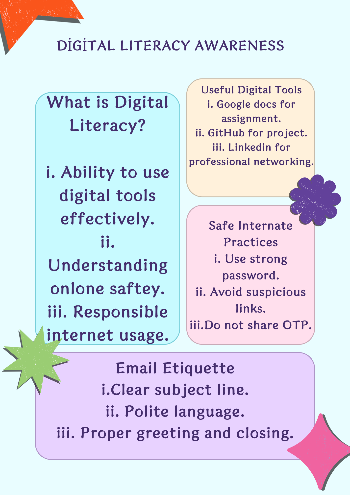
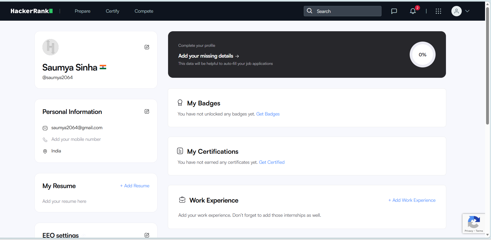

# digital-literacy-project

Name: Saumya Sinha

Registration No.: 25BAI11388

Branch: B.Tech CSE (AI&ML)

Year: 1st Year

Course Code: CSE0001

📌 Project Overview
This project is created as part of the CSE0001 Digital Literacy course. The aim is to develop essential digital skills such as online safety, professional communication, and use of digital platforms.
As a Student Digital Ambassador, I completed five tasks covering infographic design, digital portfolio creation, coding practice, email etiquette, and cybercrime awareness.

🎨 Task 1: Digital Literacy Infographic
📌 Objective
To create a visual infographic that explains the concept of digital literacy and its importance for students.

 

## Task 2: Student Digital Portfolio  

### GitHub Profile

github.png

### LinkedIn Profile

### HackerRank Profile

